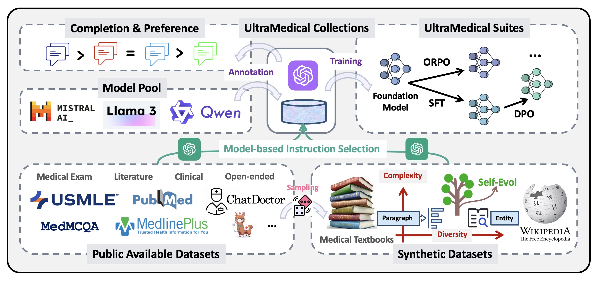
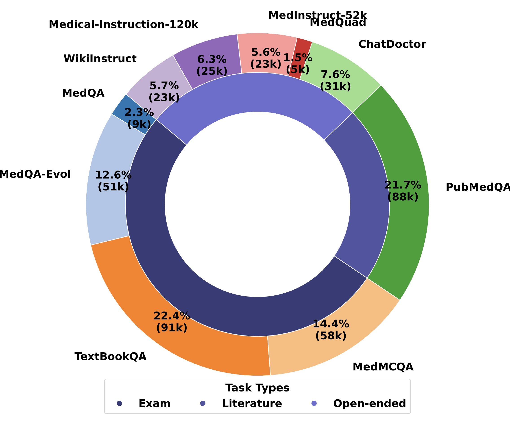
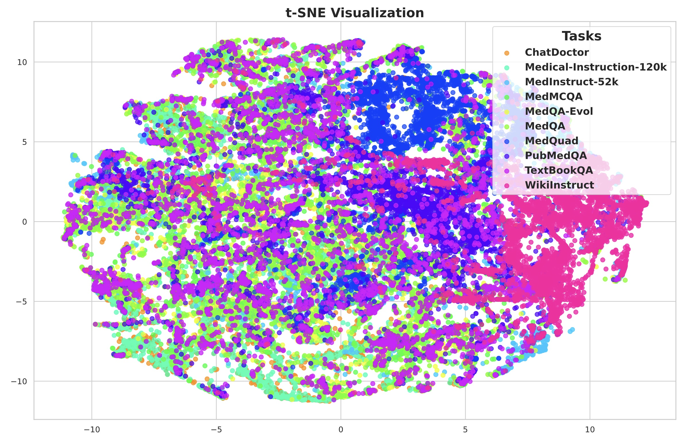

<div align="center">
<h1>
  UltraMedical: Building Specialized Generalists in Biomedicine.
</h1>
</div>

<p align="center">
  <a href="https://huggingface.co/datasets/TsinghuaC3I/UltraMedical">Dataset</a> •
  <a href="https://huggingface.co/TsinghuaC3I/Llama-3-8B-UltraMedical">Weights</a> •
  <a href="https://huggingface.co/spaces/TsinghuaC3I/UltraMedical-LM">Demo</a> •
  <a href="https://github.com/TsinghuaC3I/UltraMedical">Paper (coming soon)</a>
</p>


<!-- <div style="display: flex; justify-content: space-around; align-items: center;" align="center">
  
</div> -->

This project aims to develop specialized generalist models in the field of biomedicine. These models are designed to excel at answering questions related to exams, clinical scenarios, and research problems while maintaining a broad general knowledge base to effectively handle cross-cutting fields.

To achieve this goal, we have constructed a large-scale, high-quality dataset of biomedical instructions mixing synthetic and manual data along with preference annotation, called **UltraMedical**. This dataset is built on the principles of diversity and complexity, ensuring that the models trained on it can handle a wide range of tasks and scenarios.

Our training process involves the use of advanced alignment technologies, including Supervised Fine-Tuning (SFT), Direct Preference Optimization (DPO), and Odds Ratio Preference Optimization (ORPO). By leveraging these techniques and training large language models on the UltraMedical dataset, we aim to create powerful and versatile models that can effectively serve the needs of the biomedical community.


## The UltraMedical Collections

The UltraMedical Collections is a large-scale, high-quality dataset of biomedical instructions, comprising 410,000 synthetic and manually curated samples.

Statistics of datasets in the UltraMedical collections is shown in following table, where datasets marked with ★ represent our customized synthetic data, while the others are adapted from publicly available data.
`# Filtered` represents the remaining data size after filtering by model-based scoring, while `# Instructions` refers to the original size of the dataset.

| Category      | Synthetic | Dataset                   | # Instructions | Avg.Len of Instruction  | Avg.Score of Instruction | # Filtered |
|---------------|-----------|---------------------------|----------------|-------------------------|--------------------------|------------|
| Medical Exam  | ✘         | MedQA                     | 10.2k          | 128.94 ± 44.4  | 7.35 ± 0.98     | 9.3k       |
|               | ✘         | MedMCQA                   | 183k           | 23.12 ± 15.44  | 4.73 ± 2.14     | 59k        |
|               | ✔︎         | ★ MedQA-Evol              | 51.8k          | 76.52 ± 24.97  | 8.07 ± 0.9      | 51.8k      |
|               | ✔︎         | ★ TextBookQA              | 91.7k          | 75.92 ± 25.77  | 7.72 ± 0.79     | 91.7k      |
| Literature    | ✘         | PubMedQA                  | 211k           | 218.2 ± 51.01  | 7.95 ± 1.08     | 88.7k      |
| Open-ended    | ✘         | ChatDoctor                | 100k           | 98.93 ± 50.81  | 6.83 ± 2.16     | 31.1k      |
|               | ✘         | MedQuad                   | 47k            | 8.21 ± 2.38    | 4.54 ± 2.43     | 6k         |
|               | ✔︎         | MedInstruct-52k           | 52k            | 36.05 ± 22.96  | 5.25 ± 2.16     | 23k        |
|               | ✔︎         | Medical-Instruction-120k  | 120k           | 84.93 ± 50.85  | 5.36 ± 3.18     | 25k        |
|               | ✔︎         | ★ WikiInstruct            | 23k            | 46.73 ± 11.1   | 8.8 ± 0.52      | 23k        |
| Mixed         | Mixed     | ☆ UltraMedical            | 410k           | 101.63 ± 79.39 | 8.2 ± 0.96      | 410k       |


### Construction

- **Principle of Diversity**

    - UltraMedical encompasses a variety of question types, including medical exam questions, literature-based questions, and open-ended instructions (clinical questions, research questions, and others). It comprises 12 manual and synthetic datasets. For publicly available datasets, we have gathered questions from multiple sources, including medical exams, medical literature, clinical questions, and open-ended instructions. These datasets feature not only manually curated instructions but also prompted instructions from GPT-4.  The various data sources preliminarily enable the diversity principle of the UltraMedical dataset.

    - In addition to public datasets, we have created three synthetic datasets to augment the UltraMedical collection. One such dataset, named TextBookQA, consists of multiple-choice questions derived from medical textbooks, using questions from MedQA as in-context examples. The other, WikiInstruct, aggregates thousands of biomedical concepts from Wikipedia pages and expands them into more detailed knowledge and instructions.

- **Principle of Complexity**

    -  Beyond the diversity characteristic, UltraMedical also upholds the principle of complexity to inject knowledge and enhance reasoning through complex instructions. There are primarily two methods to enhance the complexity of instructions, either pre-hoc or post-hoc. The former involves starting with various seed instructions to synthesize new instructions, followed by employing self-evolution on these synthetic instructions. The latter method involves filtering instructions using heuristic rules or model-based rankers to select the most complex instructions.

    - During the construction of the UltraMedical dataset, we employ both pre-hoc and post-hoc methods to enhance the complexity of the instructions. For publicly available datasets, we use *gpt-3.5-turbo* to assign a scale score ranging from 1 to 10 to each instruction, where 1 indicates an instruction that is easy to answer and 10 denotes one that is challenging for a powerful AI assistant. For our synthetic dataset, we combine pre-hoc and post-hoc methods to ensure the complexity of the instructions. Initially, we implement a two-step self-evolution process on all synthetic instructions, and then further filter them based on model-derived scores.


<div style="display: flex; justify-content: space-around; align-items: center;" align="center">
  
  
</div>

### Annotation and Decontamination

We annotate answers using *gpt-4-turbo* to optimize responses for supervised fine-tuning.
For multiple-choice questions, the chain-of-thought (CoT) method has proven effective in distilling knowledge from large to smaller language models.
Therefore, we instruct *gpt-4-turbo* to answer each question step by step.
Subsequently, we verify the answers against the ground truth and filter out incorrect responses.
For incorrect answers, we further engage *gpt-4-turbo* with dynamically retrieved few-shot CoT examples from our annotated database.
This process enables us to maximize the number of potential candidate samples while ensuring the quality of the completions.


To prevent test set leakage as a result of employing large-scale synthetic data, we conduct decontamination operations, similar to the methods outlined in the [bagel project](https://github.com/jondurbin/bagel/tree/main).

### Data Format & Release

**Huggingface: [UltraMedical](https://huggingface.co/datasets/TsinghuaC3I/UltraMedical)**

Examples can be found in the [data/examples.json](data/examples.json) file.

```json
  {
    "id":"TextBookQA,Anatomy_Gray_28",
    "type":"mc",
    "conversations":[                                                              
      {
        "value":"For a 55-year-old male with chronic obstructive pulmonary disease in acute distress and unable to maintain an upright position, which radiographic technique is optimal, and how should the potential magnification of the cardiac silhouette be factored into the interpretation?\n\nA. AP chest radiograph, without differentiating it from PA radiograph in assessing heart size\nB. Lateral chest radiograph, ignoring the significance of the patient's posture during film placement\nC. AP chest radiograph, considering potential cardiac silhouette magnification in analysis\nD. PA chest radiograph, with no adjustment for the patient's inability to stand",
        "from":"human"
      },
      {
        "value":"For a patient in acute distress who is unable to maintain an upright position, the most practical and commonly used radiographic technique is the anteroposterior (AP) chest radiograph. This is because the patient may not be able to stand for a posteroanterior (PA) chest radiograph, which is the standard view for chest imaging when the patient is able to stand upright and take a deep breath.\n\nThe PA view is preferred under normal circumstances because it minimizes the magnification of the heart. In a PA chest radiograph, the heart is closer to the image receptor, which reduces the enlargement of the cardiac silhouette that can occur due to the divergent nature of x-rays. However, in an AP chest radiograph, which is taken from the front, the heart is further away from the image receptor, and the x-rays have to travel a greater distance from the source to the film, which results in some magnification of the heart.\n\nWhen interpreting an AP chest radiograph, especially in the context of a patient who is unable to sit or stand upright, it is essential to factor in the potential magnification of the cardiac silhouette. This magnification can lead to the appearance of an enlarged heart, which could be misinterpreted as cardiomegaly if the radiograph is not carefully analyzed with this consideration in mind.\n\nTherefore, the optimal choice for a 55-year-old male with chronic obstructive pulmonary disease (COPD) in acute distress who cannot maintain an upright position is:\n\nC. AP chest radiograph, considering potential cardiac silhouette magnification in analysis\n\nThis choice acknowledges the practical limitations of the patient's condition and the importance of interpreting the radiograph with an understanding of the potential for magnification of the heart.\n\nSo, the answer is C.",
        "from":"gpt"
      }
    ],
    "answer":"C",
    "score":"This question would be rated as a 9. It requires a deep understanding of radiographic techniques, the impact of patient positioning on imaging, and the interpretation of cardiac silhouette magnification. Additionally, it involves technical terminology related to radiography and medical conditions."
  }
```

## The UltraMedical Suites

The UltraMedical suites are a series of chat language models trained on UltraMedical, including small and large scale (7B-level and 70B-level) models.

### Small Scale LMs (7B-level)

We fine-tuned and released Meta-Llama-3-8B on UltraMedical and achieved the best average results among 7B-level models on popular medical benchmarks, including MedQA, MedMCQA, PubMedQA, and MMLU-Medical. We would like to acknowledge Meta's remarkable Llama model, which served as an excellent base for our fine-tuning process.

- **Demo: [Huggingface Space](https://huggingface.co/spaces/TsinghuaC3I/UltraMedical-LM)** - **Huggingface: [Llama-3-8B-UltraMedical](https://huggingface.co/TsinghuaC3I/Llama-3-8B-UltraMedical)**

> Note: This version of the model supports only single-turn dialog and has limited capabilities in multi-turn dialogue. We plan to enhance this in the next update.

| Released Date |                 Model                  | Average | MedQA | MedMCQA | PubMedQA | MMLU.ck | MMLU.mg | MMLU.an | MMLU.pm | MMLU.cb | MMLU.cm |
|:-------------:|:--------------------------------------:|:-------:|:-----:|:-------:|:--------:|:-------:|:-------:|:-------:|:-------:|:-------:|:-------:|
|    2024.04    | **Llama-3-8B-UltraMedical (Ensemble)** |  77.77  | 77.5  |  63.8   |   78.2   |  77.4   |  88.0   |  74.8   |  84.6   |  79.9   |  75.7   |
|    2024.04    |  **Llama-3-8B-UltraMedical (Greedy)**  |  75.20  | 73.3  |  61.5   |   77.0   |  78.9   |  78.0   |  74.1   |  83.8   |  78.5   |  71.7   |
|    2024.04    |              OpenBioLM-8B              |  72.48  | 59.0  |  56.9   |   74.1   |  76.1   |  86.1   |  69.8   |  78.2   |  84.2   |  68.0   |
|    2024.04    |     Llama-3-8B-Instruct (Ensemble)     |  71.23  | 62.4  |  56.5   |   75.8   |  72.5   |  84.0   |  71.1   |  70.6   |  80.6   |  67.6   |
|    2024.04    |      Llama-3-8B-Instruct (Greedy)      |  68.56  | 60.9  |  50.7   |   73.0   |  72.1   |  76.0   |  63.0   |  77.2   |  79.9   |  64.2   |
|    2024.04    |              Internist-7B              |  67.79  | 60.5  |  55.8   |   79.4   |  70.6   |  71.0   |  65.9   |  76.1   |    -    |  63.0   |
|    2024.02    |                Gemma-7B                |  64.18  | 47.2  |  49.0   |   76.2   |  69.8   |  70.0   |  59.3   |  66.2   |  79.9   |  60.1   |
|    2024.03    |         Meerkat-7B (Ensemble)          |  63.94  | 74.3  |  60.7   |    -     |  61.9   |  70.4   |  61.5   |  69.5   |  55.4   |  57.8   |
|    2023.03    |               MedAlpaca                |  58.03  | 41.7  |  37.5   |   72.8   |  57.4   |  69.0   |  57.0   |  67.3   |  65.3   |  54.3   |
|    2024.02    |             BioMistral-7B              |  57.26  | 46.6  |  45.7   |   68.1   |  63.1   |  63.3   |  49.9   |  57.4   |  63.4   |  57.8   |

In the table above:

- For MedQA, we use the 4 options from the US set. For MedMCQA, we use the Dev split. For PubMedQA, we use the reasoning required set.

- For MMLU, we include Clinical Knowledge (CK), Medical Genetics (MG), Anatomy (An), Professional Medicine (PM), College Biology (CB), and College Medicine (CM) to maintain consistency with previous studies.

- Greedy search is employed as our default decoding strategy. We denote ensemble scores with self-consistency as `(Ensemble)`. In our experiments, we conduct 10 decoding trials, and final decisions are made via majority vote (temperature=0.7, top_p=0.9).

- Partial results for 7B pre-trained models are sourced from the [Open Medical-LLM Leaderboard](https://huggingface.co/spaces/openlifescienceai/open_medical_llm_leaderboard).

### Large Scale LMs (70B-level)

The Llama-3-70B-UltraMedical are coming soon...

| Released Date |         Model          | Average | MedQA | MedMCQA | PubMedQA | MMLU.ck | MMLU.mg | MMLU.an | MMLU.pm | MMLU.cb | MMLU.cm |
|:-------------:|:----------------------:|:-------:|:-----:|:-------:|:--------:|:-------:|:-------:|:-------:|:-------:|:-------:|:-------:|
|    2023.11    |   GPT-4 (Medprompt)    |  90.76  | 90.2  |  79.1   |   82.0   |  95.8   |  98.0   |  89.6   |  95.2   |  97.9   |  89.0   |
|    2023.06    |  GPT-4-base (5-shot)   |  87.00  | 86.1  |  73.7   |   80.4   |  88.7   |  97.0   |  85.2   |  93.8   |  97.2   |  80.9   |
|    2023.04    |   Med-PaLM 2 (best)    |  86.66  | 86.5  |  72.3   |   81.8   |  88.7   |  92.0   |  84.4   |  95.2   |  95.8   |  83.2   |
|    2024.04    |     OpenBioLM-70B      |  86.06  | 78.2  |  74.0   |   79.0   |  92.9   |  93.2   |  83.9   |  93.8   |  93.8   |  85.7   |
|    2023.04    |    Med-PaLM 2 (ER)     |  85.46  | 85.4  |  72.3   |   75.0   |  88.7   |  92.0   |  84.4   |  92.3   |  95.8   |  83.2   |
|    2023.03    |   GPT-4 (0-shot CoT)   |  85.36  | 85.8  |  72.3   |   70.0   |  90.2   |  94.0   |  84.4   |  94.5   |  93.8   |  83.2   |
|    2023.03    |     GPT-4 (5-shot)     |  83.69  | 81.4  |  72.4   |   75.2   |  86.4   |  92.0   |  80.0   |  93.8   |  95.1   |  76.9   |
|    2024.04    |  Llama-3-70B-Instruct  |  82.66  | 79.9  |  69.6   |   75.8   |  87.2   |  93.0   |  76.3   |  88.2   |  92.4   |  81.5   |
|    2022.10    |    Flan-PaLM (best)    |  74.70  | 67.6  |  57.6   |   79.0   |  80.4   |  75.0   |  63.7   |  83.8   |  88.9   |  76.3   |
|    2024.04    | Mixtral-8x22B-Instruct |  73.10  | 63.3  |  71.4   |   84.2   |  89.0   |  77.0   |  88.2   |  88.2   |  78.0   |  79.2  |
|    2022.11    |     GPT-3.5-Trubo      |  67.70  | 57.7  |  72.7   |   53.8   |  74.7   |  74.0   |  65.9   |  72.8   |  72.9   |  64.7   |
|    2023.11    |      Meditron-70B      |  66.00  | 57.7  |  53.8   |   72.7   |  66.8  |   69.0   |  53.3   |  71.7   |  76.4   |  63.0   |

> We conduct experiments to gather results on `Mixtral-8x22B-Instruct` and `Llama-3-70B-Instruct`, and integrate additional results from the [Medprompt paper](https://arxiv.org/abs/2311.16452).


## TODO

- [x] Release the UltraMedical collections v0

- [x] Train Meta-Llama-3-8B with UltraMedical and release Llama-3-8B-UltraMedical

- [ ] Release the preference annotation for UltraMedical

- [ ] Train and release Meta-Llama-70B with UltraMedical

## Limitations

While the UltraMedical suites show promising performance on several benchmarks, they still have limitations, such as hallucinations. Additionally, the outputs are synthesized from GPT-4, which may also exhibit bias. We plan to address these issues and verify the accuracy of facts in UltraMedical in future research.

## Acknowledgement

We would like to thank the open-sourcing dataset in [Kent0n-Li/ChatDoctor](https://github.com/Kent0n-Li/ChatDoctor), [Mohammed-Altaf/medical-instruction-120k](https://huggingface.co/datasets/Mohammed-Altaf/medical-instruction-120k), [XZhang97666/AlpaCare](https://github.com/XZhang97666/AlpaCare), [MedRAG/textbooks](https://huggingface.co/datasets/MedRAG/textbooks), which heavily contribute to our UltraMedical collections.

We would also like to thank Meta release the wonderful [Llama-3](https://huggingface.co/collections/meta-llama/).

## Citation

Feel free to cite the repo if you think UltraMedical is useful.

```latex
@misc{UltraMedical,
  author = {Zhang, Kaiyan and Ding, Ning and Qi, Biqing and Zeng, Sihang and Li, Haoxin and Zhu, Xuekai and Chen, Zhang-Ren and Zhou, Bowen},
  title = {UltraMedical: Building Specialized Generalists in Biomedicine.},
  year = {2024},
  publisher = {GitHub},
  journal = {GitHub repository},
  howpublished = {\url{https://github.com/TsinghuaC3I/UltraMedical}},
}
```