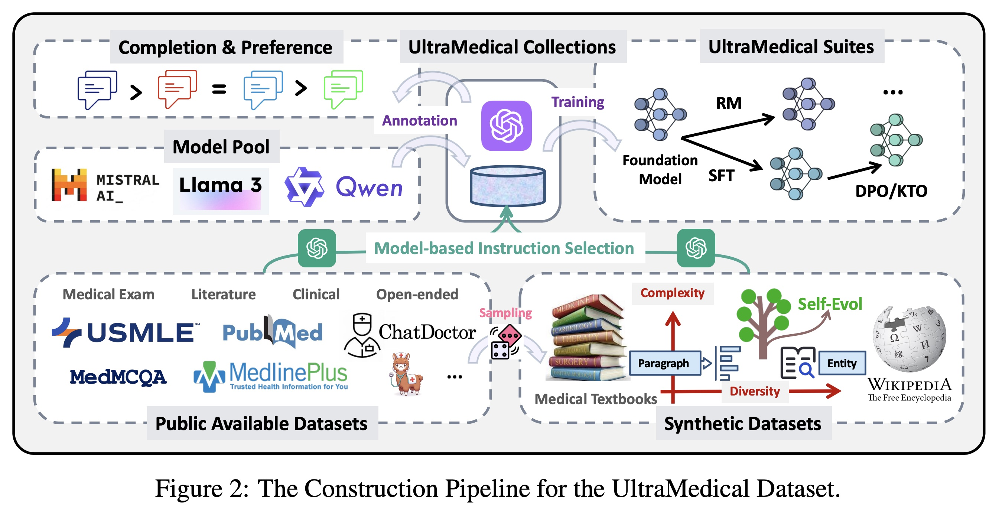

<div align="center">
<h1>
  UltraMedical: Building Specialized Generalists in Biomedicine.
</h1>
</div>

<p align="center">
  <!-- <a href="https://huggingface.co/datasets/TsinghuaC3I/UltraMedical">SFT Dataset</a> •
  <a href="https://huggingface.co/datasets/TsinghuaC3I/UltraMedical-Preference">Pref Dataset</a> • -->
  <a href="https://huggingface.co/collections/TsinghuaC3I/ultramedical-66d4076bad293ffc4bc41327">🤗 Dataset & Model Collection</a> •
  <a href="https://huggingface.co/spaces/TsinghuaC3I/UltraMedical-LM">🤗 Demo</a> •
  <a href="https://arxiv.org/abs/2406.03949">📃 Paper</a>
</p>

## News
- [Sep, 2024] The UltraMedical paper has been accepted as a spotlight at NeurIPS2024 D&B Track! 🎉
- [Aug, 2024] We released UltraMedical preference dataset and models basd on Llama3 70B and Llama3.1 8B!
- [Jun, 2024] The preprint UltraMedical paper has been published on arxiv!
- [April, 2024] The UltraMedical instruction dataset and model based on Llama3 8B have been released!

<!-- <div style="display: flex; justify-content: space-around; align-items: center;" align="center">
  
</div> -->

## Introduction


This project aims to develop specialized generalist models in the field of biomedicine. These models are designed to excel at answering questions related to exams, clinical scenarios, and research problems while maintaining a broad general knowledge base to effectively handle cross-cutting fields.

To achieve this goal, we have constructed a large-scale, high-quality dataset of biomedical instructions mixing synthetic and manual data along with preference annotation, called **UltraMedical**. This dataset is built on the principles of diversity and complexity, ensuring that the models trained on it can handle a wide range of tasks and scenarios.

Our training process involves the use of advanced alignment technologies, including Supervised Fine-Tuning (SFT), Direct Preference Optimization (DPO), and Kahneman-Tversky Optimization (KTO). By leveraging these techniques and training large language models on the UltraMedical dataset, we aim to create powerful and versatile models that can effectively serve the needs of the biomedical community.

## Released

| Item |  Link |
| :----: | :----: |
| Dataset | 🤗 [TsinghuaC3I/UltraMedical](https://huggingface.co/datasets/TsinghuaC3I/UltraMedical) |
| Dataset | 🤗 [TsinghuaC3I/UltraMedical-Preference](https://huggingface.co/datasets/TsinghuaC3I/UltraMedical-Preference) |
| Model | 🤗 [TsinghuaC3I/Llama-3-8B-UltraMedical](https://huggingface.co/TsinghuaC3I/Llama-3-8B-UltraMedical) |
| Model | 🤗 [TsinghuaC3I/Llama-3-70B-UltraMedical](https://huggingface.co/TsinghuaC3I/Llama-3-70B-UltraMedical) |
| Model | 🤗 [TsinghuaC3I/Llama-3.1-8B-UltraMedical](https://huggingface.co/TsinghuaC3I/Llama-3.1-8B-UltraMedical) |
| Model | 🤗 TsinghuaC3I/Llama-3.1-70B-UltraMedical |


## The UltraMedical Collections

The UltraMedical Collections is a large-scale, high-quality dataset of biomedical instructions, comprising 410,000 synthetic and manually curated samples, along with more than 100,000 preference data.


### Running Code



The data construction pipeline for UltraMedical is illustrated in Figure 2. All steps for data synthesis are located in the [src/pipeline](src/pipeline) directory, with detailed descriptions provided in the table below.

| Filename                     | Operation                                                    | Applied Dataset                      |
| ---------------------------- | ------------------------------------------------------------ | ------------------------------------ |
| [run_textbook_synthesize.py](src/pipeline/run_textbook_synthesize.py) | Generates synthetic samples from paragraphs in textbooks     | TextBookQA                           |
| [run_wikipedia_topic.py](src/pipeline/run_wikipedia_topic.py)     | Synthesizes instructions based on entities from Wikipedia    | WikiInstruct                         |
| [run_instruct_evol.py](src/pipeline/run_instruct_evol.py)       | Evolves instructions based on the InstructEvol methodology (see [evol-instruct](https://github.com/nlpxucan/evol-instruct)) | MedQA-Evol, WikiInstruct, TextBookQA |
| [run_score.py](src/pipeline/run_score.py)               | Scores instructions for filtering                            | All datasets                         |
| [run_decontaminate.py](src/pipeline/run_decontaminate.py)       | Decontaminates test data within UltraMedical (see [bagel project](https://github.com/jondurbin/bagel/tree/main)) | All datasets                         |
| [run_feedback.py](src/pipeline/run_feedback.py)            | Requests feedback from GPT-4 on instructions and response candidates | All datasets                         |

**Note:** We provide example data for various operations in the `src/pipeline/data` directory. You can use these examples as a reference to customize your own dataset. And you should first export environment variable for OpenAI, i.e., `export OPENAI_API_KEY="sk-xxxx"` and `export OPENAI_API_BASE="https://api.openai.com/v1"`.


### Data Format & Release

**Huggingface: [UltraMedical](https://huggingface.co/datasets/TsinghuaC3I/UltraMedical), [UltraMedical-Preference](https://huggingface.co/datasets/TsinghuaC3I/UltraMedical-Preference)**

Examples can be found in the [data/examples.json](data/examples.json) file.

```json
  {
    "id":"TextBookQA,Anatomy_Gray_28",
    "type":"mc",
    "conversations":[                                                              
      {
        "value":"For a 55-year-old male with chronic obstructive pulmonary disease in acute distress and unable to maintain an upright position, which radiographic technique is optimal, and how should the potential magnification of the cardiac silhouette be factored into the interpretation?\n\nA. AP chest radiograph, without differentiating it from PA radiograph in assessing heart size\nB. Lateral chest radiograph, ignoring the significance of the patient's posture during film placement\nC. AP chest radiograph, considering potential cardiac silhouette magnification in analysis\nD. PA chest radiograph, with no adjustment for the patient's inability to stand",
        "from":"human"
      },
      {
        "value":"For a patient in acute distress who is unable to maintain an upright position, the most practical and commonly used radiographic technique is the anteroposterior (AP) chest radiograph. This is because the patient may not be able to stand for a posteroanterior (PA) chest radiograph, which is the standard view for chest imaging when the patient is able to stand upright and take a deep breath.\n\nThe PA view is preferred under normal circumstances because it minimizes the magnification of the heart. In a PA chest radiograph, the heart is closer to the image receptor, which reduces the enlargement of the cardiac silhouette that can occur due to the divergent nature of x-rays. However, in an AP chest radiograph, which is taken from the front, the heart is further away from the image receptor, and the x-rays have to travel a greater distance from the source to the film, which results in some magnification of the heart.\n\nWhen interpreting an AP chest radiograph, especially in the context of a patient who is unable to sit or stand upright, it is essential to factor in the potential magnification of the cardiac silhouette. This magnification can lead to the appearance of an enlarged heart, which could be misinterpreted as cardiomegaly if the radiograph is not carefully analyzed with this consideration in mind.\n\nTherefore, the optimal choice for a 55-year-old male with chronic obstructive pulmonary disease (COPD) in acute distress who cannot maintain an upright position is:\n\nC. AP chest radiograph, considering potential cardiac silhouette magnification in analysis\n\nThis choice acknowledges the practical limitations of the patient's condition and the importance of interpreting the radiograph with an understanding of the potential for magnification of the heart.\n\nSo, the answer is C.",
        "from":"gpt"
      }
    ],
    "answer":"C",
    "score":"This question would be rated as a 9. It requires a deep understanding of radiographic techniques, the impact of patient positioning on imaging, and the interpretation of cardiac silhouette magnification. Additionally, it involves technical terminology related to radiography and medical conditions."
  }
```

## The UltraMedical Suites

The UltraMedical suites are a series of chat language models trained on UltraMedical, including small and large scale (7B-level and 70B-level) models.

### Running Code

The code for Supervised Fine-Tuning (SFT), Direct Preference Optimization (DPO), and Kahneman-Tversky Optimization (KTO) is primarily adapted from [huggingface/alignment-handbook](https://github.com/huggingface/alignment-handbook/tree/main). The code for reward modeling is based on [RLHFlow/RLHF-Reward-Modeling](https://github.com/RLHFlow/RLHF-Reward-Modeling).

All config for model training can be found in the [src/finetune/config](src/finetune/config) directory, you can run the following command to finetune models.

```bash
# sft
bash scripts/run_sft.sh

# dpo
bash scripts/run_xpo.sh

# For kto/nca, please modify config path in scripts/run_xpo.sh (Still use `run_dpo.py` code)
```


### SFT and Preference Learning

We fine-tuned and released Meta-Llama-3-8B on UltraMedical and achieved the best average results among 7B-level models on popular medical benchmarks, including MedQA, MedMCQA, PubMedQA, and MMLU-Medical. Moreover, our 70B model achieved an 86.5 on MedQA-USMLE, marking the highest result among open-source LLMs and comparable to MedPaLM 2 and GPT-4. We would like to acknowledge Meta's remarkable Llama model, which served as an excellent base for our fine-tuning process.

- **Demo: [Huggingface Space](https://huggingface.co/spaces/TsinghuaC3I/UltraMedical-LM)** - **Huggingface: [Llama-3-8B-UltraMedical](https://huggingface.co/TsinghuaC3I/Llama-3-8B-UltraMedical)**


In the table above:

- For MedQA, we use the 4 options from the US set. For MedMCQA, we use the Dev split. For PubMedQA, we use the reasoning required set.

- For MMLU, we include Clinical Knowledge (CK), Medical Genetics (MG), Anatomy (An), Professional Medicine (PM), College Biology (CB), and College Medicine (CM) to maintain consistency with previous studies.

- Greedy search is employed as our default decoding strategy. We denote ensemble scores with self-consistency as `(Ensemble)`. In our experiments, we conduct 10 decoding trials, and final decisions are made via majority vote (temperature=0.7, top_p=0.9).

- Partial results for 7B pre-trained models are sourced from the [Open Medical-LLM Leaderboard](https://huggingface.co/spaces/openlifescienceai/open_medical_llm_leaderboard).


> We conduct experiments to gather results on `Mixtral-8x22B-Instruct` and `Llama-3-70B-Instruct`, and integrate additional results from the [Medprompt paper](https://arxiv.org/abs/2311.16452).

### Reward Modeling

Inspired by the RewardBench initiative, the Medical RewardBench is crafted from the test split of the UltraMedical-Preference dataset. Experts in the biomedical field revised the labels annotated by GPT-4, with the benchmark divided into categories such as Easy, Hard, Length, and Human.


## Limitations

While the UltraMedical suites show promising performance on several benchmarks, they still have limitations, such as hallucinations. Additionally, the outputs are synthesized from GPT-4, which may also exhibit bias. We plan to address these issues and verify the accuracy of facts in UltraMedical in future research.

## Acknowledgement

We would like to thank the open-sourcing dataset in [Kent0n-Li/ChatDoctor](https://github.com/Kent0n-Li/ChatDoctor), [Mohammed-Altaf/medical-instruction-120k](https://huggingface.co/datasets/Mohammed-Altaf/medical-instruction-120k), [XZhang97666/AlpaCare](https://github.com/XZhang97666/AlpaCare), [MedRAG/textbooks](https://huggingface.co/datasets/MedRAG/textbooks), which heavily contribute to our UltraMedical collections.

We would also like to thank Meta release the wonderful [Llama-3](https://huggingface.co/collections/meta-llama/) and [Llama-3.1](https://huggingface.co/collections/meta-llama/llama-31-669fc079a0c406a149a5738f).

## Citation

Feel free to cite the repo if you think UltraMedical is useful.

```latex
@misc{zhang2024ultramedical,
      title={UltraMedical: Building Specialized Generalists in Biomedicine}, 
      author={Kaiyan Zhang and Sihang Zeng and Ermo Hua and Ning Ding and Zhang-Ren Chen and Zhiyuan Ma and Haoxin Li and Ganqu Cui and Biqing Qi and Xuekai Zhu and Xingtai Lv and Hu Jinfang and Zhiyuan Liu and Bowen Zhou},
      year={2024},
      eprint={2406.03949},
      archivePrefix={arXiv},
      primaryClass={cs.CL}
}
```


